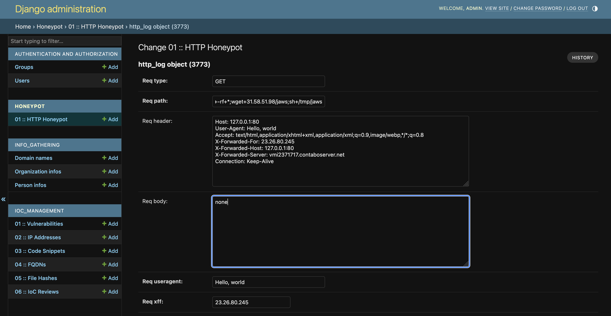

# eg0n :: IoC management project

eg0n is a Django-based application designed to archive and manage IoC and CTI data.
The project started in 2024 as an idea by @roccosicilia, proposed to the BitHorn community.

Its primary goal is to provide seamless integration of IoCs into third-party security tools, enabling more effective threat hunting and detection.

# Contributing

We’d love your help in improving this project!
You can connect with the community or reach out to the project owner here:

- Join the discussion on our subreddit: [r/BitHorn](https://www.reddit.com/r/BitHorn)
- Contact the project maintainer: [u/Sheli4k on reddit](https://www.reddit.com/user/Sheli4k), [blog](https://www.roccosicilia.com/about)
